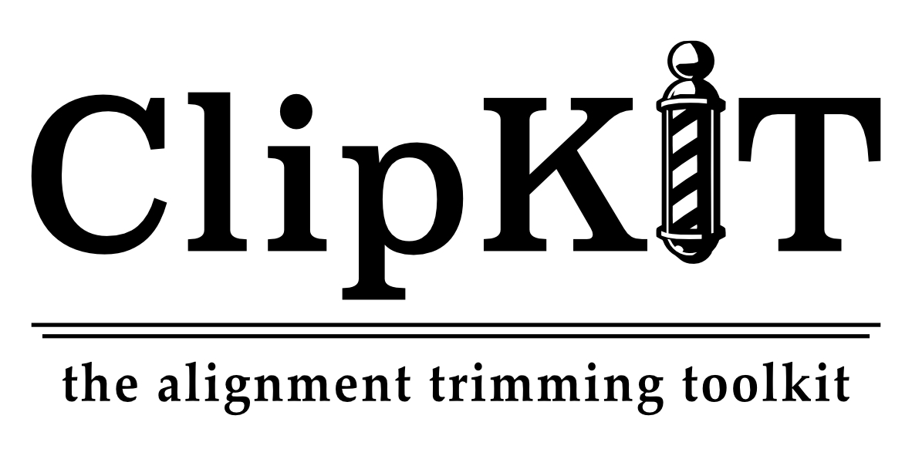

<p align="center">
  <a href="https://github.com/jlsteenwyk/clipkit">
    
  </a>
  <p align="center">
    <a href="https://jlsteenwyk.github.io/clipkit">Docs</a>
    ·
    <a href="https://github.com/jlsteenwyk/clipkit/issues">Report Bug</a>
    ·
    <a href="https://github.com/jlsteenwyk/clipkit/issues">Request Feature</a>
  </p>
    <p align="center">
        <a href="https://github.com/jlsteenwyk/clipkit/graphs/contributors" alt="Contributors">
            
        </a>
        <a href="https://twitter.com/intent/follow?screen_name=jlsteenwyk">
            
        </a>
    </p>
</p>

ClipKIT is a fast and flexible alignment trimming tool that keeps phylogenetically informative sites and removes those that display characteristics poor phylogenetic signal.<br /><br />
If you found clipkit useful, please cite **Add journal and citation information**
<br /><br />


---


## Guide
[Quick Start](#quick-start)<br />
[Advanced Usage](#advanced-usage)<br />
[Performance Assessment](#performance-assessment)


---

## Quick Start
### 1) Installation
To install, use the following commands:
```
pip install clipkit # Currently not implemented while in development
```
<br />

To install from source, use the following commands:
```shell
git clone https://github.com/JLSteenwyk/ClipKIT.git
cd ClipKIT/
make install
```
<br />

If you run into permission errors when executing *make install*, create a virtual environment for your installation:
```shell
git clone https://github.com/JLSteenwyk/ClipKIT.git
cd ClipKIT/
python -m venv .venv
source .venv/bin/activate
make install
```
Note, the virtual environment must be activated to use clipkit.
<br />

### 2) Usage
To use ClipKIT in its simpliest form, execute the following command:
```
clipkit <input>
```
Output file with the suffix ".clipkit"

<br />

---

### Advanced Usage
This section describes the various features and options of ClipKIT.<br />
\- [Modes](#modes)<br />
\- [Log](#log)<br />
\- [Complementary](#complementary)<br />
\- [Miscellaneous options](#miscellaneous-options)

<br />

### Modes
ClipKIT can be run with five different modes (gappy, kpic, kpic-gappy, kpi, and kpi-gappy), which are specified with the -m/--mode argument.<br /> 
*Default: 'gappy'*<br />
* gappy: trim all sites that are above a threshold of gappyness (default: 0.9)<br />
* kpic: keep only parismony informative and constant sites<br />
* kpic-gappy: a combination of kpic- and gappy-based trimming<br />
* kpi: keep only parsimony informative sites<br />
* kpi-gappy: a combination of kpi- and gappy-based trimming<br />
```
# gappy-based trimming
clipkit <input>
clipkit <input> -m gappy

# kpic-based trimming
clipkit <input> -m kpic

# kpic- and gappy-based trimming
clipkit <input> -m kpic-gappy

# kpi-based trimming
clipkit <input> -m kpi

# kpi- and gappy-based trimming
clipkit <input> -m kpi-gappy 
```

<br />

### Log
It can be very useful to have information about the each position in an alignment. For example, this information could be used in alignment diagnostics, fine-tuning of trimming parameters, etc. To create the log file, use the -l/--log option. Using this option will create a four column file with the suffix '.clipkit.log'. *Default: off*
* col1: position in the alignment (starting at 1)
* col2: reports if site was trimmed or kept (trim or keep, respectively)
* col3: reports if the site is constant or not (Const or nConst), parsimony informative or not (PI or nPI), or neither (nConst, nPI)
* col4: reports the gappyness of the position (number of gaps / entries in alignment)
<br />
```
clipkit <input> -l
```
Output file with the suffix ".clipkit.log"

<br />

### Complementary
Having an alignment of the sequences that were trimmed can be useful for other analyses. To obtain an alignment of the sequences that were trimmed, use the -c/--complementary option. 
*Default: off*<br />

```
clipkit <input> -c
```
Output file with the suffix '.clipkit.complementary'

<br />

### Miscellaneous options
| Option        | Usage and meaning |
| ------------- | ------------------ |
| -h/--help     | Print help message |
| -v/--version  | Print software version |
| -g/--gaps     | Specify gappyness threshold (between 0 and 1). *Default: 0.9* |
| -if/--input_file_format | Specify input file format*. *Default: auto-detect* |
| -of/--input_file_format | Specify output file format*. *Default: input file type* |

*Acceptable file formats include: [fasta](https://en.wikipedia.org/wiki/FASTA_format), [clustal](http://meme-suite.org/doc/clustalw-format.html), [maf](http://www.bx.psu.edu/~dcking/man/maf.xhtml), [mauve](http://darlinglab.org/mauve/user-guide/files.html), [phylip](http://scikit-bio.org/docs/0.2.3/generated/skbio.io.phylip.html), [phylip-sequential](http://rosalind.info/glossary/phylip-format/), [phylip-relaxed](https://www.hiv.lanl.gov/content/sequence/FORMAT_CONVERSION/FormatExplain.html), [stockholm](https://en.wikipedia.org/wiki/Stockholm_format)
<br />
<br />

---

## Performance Assessment
In brief, performance assessment and comparison of multiple trimming alignment software revealed that ClipKIT with nearly any mode and trimAl with the 'gappyout' parameter are the top-performing software. Here, we provide greater detail into the empirical datasets used to assess alignment trimming performance. 
<p align="center">
  <!--<a href="https://github.com/jlsteenwyk/clipkit"> ADD LINK TO PUB-->
    
  <!--</a>-->
</p>

**Summary Figure. Rank-based assessment of ClipKIT's performance compared to other alignment trimming software revealed ClipKIT is a top-performing software.** A dataset of 2,002 amino acid (AA) and nucleotide (NT) alignments across 24 Mammals (A, B) and 2,832 AA and NT alignments across 12 yeasts (C, D) were trimmed using ClipKIT, [trimAl](https://www.ncbi.nlm.nih.gov/pmc/articles/PMC2712344/), [BMGE](https://www.ncbi.nlm.nih.gov/pmc/articles/PMC3017758/), [Noisy](https://www.ncbi.nlm.nih.gov/pubmed/18577231), and [Gblocks](https://www.ncbi.nlm.nih.gov/pubmed/17654362). The resulting trimmed alignments were then used to infer the evolutionary history of each alignment using [IQ-Tree](https://www.ncbi.nlm.nih.gov/pubmed/32011700). To assess the accuracy and support of each topology, we calculated normalized Robinson-Foulds distances (nRF) and average bootstrap support (ABS). For every gene, we obtained one performance score by taking the average of the desirability transformed nRF and ABS values. Using the resulting desirability values, trimmers were ranked from 1 to 9 where lower ranks indicate better performance. We then determined the best performing algorithm per data set and plotted them in order of best to worst. We found that ClipKIT, trimAl (with the 'gappyout' parameter), and no trimming performed the best across all data matrices. Abbreviations of trimmers and parameters are as follows: ClipKIT: kg = kpi-gappy mode; ClipKIT: k = kpi mode; ClipKIT: g = gappy mode; trimAl: go = gappyout; trimAl: s = strictplus.
<br /><br /><br />

<p align="center">
  <!--<a href="https://github.com/jlsteenwyk/clipkit"> ADD LINK TO PUB-->
    
  <!--</a>-->
</p>

**Figure 1. ClipKIT provides 'light' and 'heavy' trimming options that perform well.** Using the same dataset of sequence alignments for mammals (A, B) and yeast (C, D), comparisons of alignment lengths, we calculated Z-scores of alignment lengths for every gene. ClipKIT's 'gappy' mode conducts the lightest trimming followed by trimAl with the 'gappyout' parameter. Interestingly, ClipKIT's 'kpi-gappy' and 'kpi' modes trim a significant amount of the alignment compared to other trimmers. Despite alignment length being associated with strong phylogenetic signal, ClipKIT's 'kpi-gappy' and 'kpi' modes resulted in alignments that were still rich in phylogenetic information (see Summary Figure.) The red dashed line represents a Z-score of zero. Abbreviations of trimmers and parameters is the same as the summary figure.
<br /><br /><br />

<p align="center">
  <!--<a href="https://github.com/jlsteenwyk/clipkit"> ADD LINK TO PUB-->
    
  <!--</a>-->
</p>

**Figure 2. ClipKIT is a top-performing software across metrics associated with strong phylogenetic signal.** Using the same dataset of sequence alignments for mammals and yeast, nRF distances (A-D) and ABS (E-H; using IQ-Tree's UFBoot), were calculated on a per-gene basis. For each gene, nRF and ABS values were z-transformed. Across these metrics ClipKIT -- no matter the mode -- was a top-performing software.

---

## Authors
* [Jacob Steenwyk](https://jlsteenwyk.github.io/)<br />
* [Thomas Buida](https://tjbiii.com)<br />
* [Yuanning Li](https://scholar.google.com/citations?user=65ygCIsAAAAJ&hl=en&oi=ao)
* [Xing-Xing Shen](https://xingxingshen.github.io/)
* [Antonis Rokas](https://as.vanderbilt.edu/rokaslab/)
<br />

## Developers
* [Jacob Steenwyk](https://jlsteenwyk.github.io/)<br />
* [Thomas Buida](https://tjbiii.com)<br />
<br />