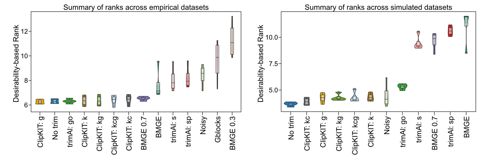
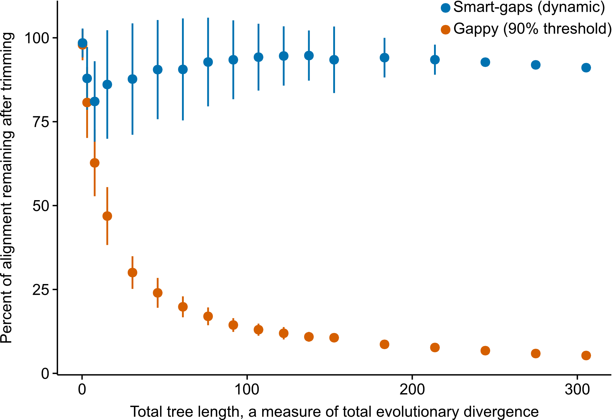

.. _performance:

Performance Assessment
======================

|

Benchmarking
------------

^^^^^

In brief, performance assessment and comparison of multiple trimming alignment software
revealed that ClipKIT is a top-performing software.

**ClipKIT is a top-performing software for trimming multiple sequence alignments.** 
Across a total of 138,152 multiple sequence alignments (MSAs) from empirical (left) and
simulated (right) datasets, desirability-based integration of accuracy and support metrics
per MSA facilitated the comparison of relative software performance and revealed ClipKIT
is a top-performing software. MSA trimming approaches are ordered along the x-axis from
the highest-performing software (left) to the lowest-performing software (right) according to average
desirability-based rank, which is derived from measures of tree accuracy (i.e., normalized Robinson
Foulds distance) and tree support (i.e., average bipartition support). 

Abbreviations of trimmers and parameters are as follows: 
ClipKIT: g = gappy mode; ClipKIT: kc = kpic; ClipKIT: kcg = kpic-gappy; ClipKIT: k = kpi mode;
ClipKIT: kg = kpi-gappy mode; BMGE = BMGE default; BMGE 0.3 = 0.3 entropy threshold;
BMGE 0.7 = 0.7 entropy threshold; trimAl: s = strict; trimAl: sp = strictplus; Noisy = default;
Gblocks = default; No trim = no trimming.

For additional details about performance assessment, please see *ClipKIT: a multiple sequence
alignment trimming software for accurate phylogenomic inference*. Steenwyk et al. PLoS Biology. doi: |doiLink|_.

.. _doiLink: https://journals.plos.org/plosbiology/article?id=10.1371/journal.pbio.3001007
.. |doiLink| replace:: 10.1371/journal.pbio.3001007 

|

smart-gap
---------

^^^^^

Starting with version 1.1.0, a dynamic gappyness threshold determination approach (referred to 
as smart-gap) has been introduced into ClipKIT and is now the default trimming approach. The 
motivation of smart-gap stems from excessive trimming among highly divergent sequences.

For example, in the figure above, we simulated 100 sequences for various trees with 100 tips. 
Each tree had a different total tree length, a measure of total evolutionary divergence (x-axis).
Differences in total tree length were generated by multiplying the branch lengths of the starting
random tree (generated using IQTREE2) by a factor ranging from 0.25 to 10. Thus, the same tree
shape and relative branch lengths were used during the simulations. Simulations were generated using
INDELible. Examining the percentage of the alignment remaining after trimming revealed using a strict 
gappy threshold of 90% resulted in 'extreme' trimming, which is not recommended (|TanLink|_).
In contrast, smart-gap retains a large fraction of the alignment and only removes the most
gappy sites. Thus, smart-gap is a better approach for sequence alignments that span deep and
shallow evolutionary timescales.

More specifically, when implementing the smart-gap approach, ClipKIT first examines the 
distribution of gaps across the alignment. Next, ClipKIT determines the gap-to-gap slope
between each gappyness bin. By examining the maximum difference in the slope between each
adjacent bin, ClipKIT determines what step would correspond to removing a large number
of sites in comparison to other steps. Of note, ClipKIT only examines the first half of
slopes calculated so as to not trim too much of the alignment. ClipKIT will then choose
the threshold that ensures the large number of sites will not be trimmed.

.. _TanLink: https://academic.oup.com/sysbio/article/64/5/778/1685763
.. |TanLink| replace:: Tan *et al.* (2015)

For example, in the the following test alignment:

.. code-block:: shell

    >1
    A-GTAT-
    >2
    A-G-AT-
    >3
    A-G-TA-
    >4
    AGA-TA-
    >5
    ACa-T-G

there are two sites with four gaps, one site with three gaps, and one
site with one gap. ClipKIT will calculate the slope between sites with
greater than or equal to 80% gaps and removing 2/7ths of the alignment
and sites with greater than or equal to 60% gaps and removing 3/7ths
of the alignment. Next, ClipKIT will determine the slope between sites
with greater than or equal to 60% gaps and removing 3/7ths of the
alignment and sites with greater than or equal to 20% gaps and removing 
4/7ths of the alignment and so on and so forth. ClipKIT will then examine
the first half of slope values and use the less strict gaps threshold
from the two points that generated the greatest difference between 
consecutive slopes.

